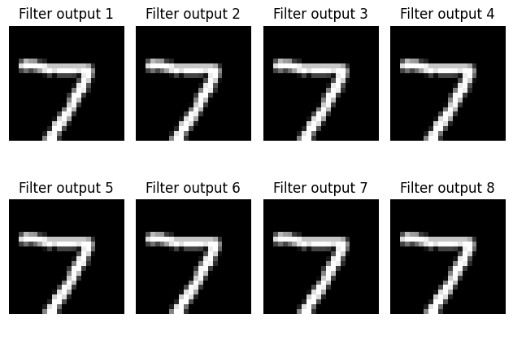
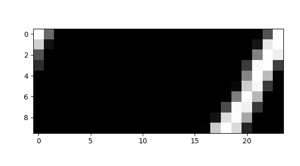

# CNN Leak
The test CNN contains 4 layers:
1) Convolutional Layer
2) RELU
3) Pooling
4) Fully connected

It is trained to detect the numbers from the MNIST dataset.

If an attacker can leak some outputs of the first layer, this can give hints onto the inputs
of the CNN.

## Leak Attacker
The attacker continuously reads stale GPU register contents and returns those to the host.

Finding the target CNN data can be difficult, due to the amount of data leaked. We narrowed
successful identification down to the following criteria by experimentation:
 - there is a block of zeros leading before the leaked data
 - the leaked data is 0x400 bytes in size
 - convolutional layer output data is between 0.0f and 2.0f

Unfortunately, we cannot leak the whole output. However, since a CNN applies multiple filter
kernels to its input (8 in our example), the data is easier to leak.

The original convolutional layer output:



Leaked data:



This image was generated by the `show_leak.py` script, which is appended to this report.

The app stores the leaked data output in `/data/data/com.example.testapp/cache/leaked_out.bin`.


Example output of the attacker app:
```
2023-09-04 15:45:30.917 15038-15074 computeShader           com.example.testapp                  I  LEAK SUCCESS at array offset 0x5c00, actual: 0x3f7efeff
2023-09-04 15:45:30.928 15038-15074 hexDump                 com.example.testapp                  I  0000: FF FF FF FF FF FF FF FF  FF FF FF FF FF FF FF FF  |  ................ 
                                                                                                    0010: FF FF FF FF FF FF FF FF  FF FF FF FF FF FF FF FF  |  ................ 
                                                                                                    0020: FF FF FF FF FF FF FF FF  FF FF FF FF FF FF FF FF  |  ................ 
                                                                                                    0030: FF FF FF FF FF FF FF FF  FF FF FF FF FF FF FF FF  |  ................ 
                                                                                                    0040: 00 00 34 42 00 00 34 42  00 00 34 42 00 00 34 42  |  ..4B..4B..4B..4B 
                                                                                                    0050: 00 00 34 42 00 00 34 42  00 00 34 42 00 00 34 42  |  ..4B..4B..4B..4B 
                                                                                                    0060: 00 00 34 42 00 00 34 42  00 00 34 42 00 00 34 42  |  ..4B..4B..4B..4B 
                                                                                                    0070: 00 00 34 42 00 00 34 42  00 00 34 42 00 00 34 42  |  ..4B..4B..4B..4B 
                                                                                                    0080: 00 00 34 42 00 00 34 42  00 00 34 42 00 00 34 42  |  ..4B..4B..4B..4B 

...

                                                                                                    59C0: 00 00 00 00 00 00 00 00  00 00 00 00 00 00 00 00  |  ................ 
                                                                                                    59D0: 00 00 00 00 00 00 00 00  00 00 00 00 00 00 00 00  |  ................ 
                                                                                                    59E0: 00 00 00 00 00 00 00 00  00 00 00 00 00 00 00 00  |  ................ 
                                                                                                    59F0: 00 00 00 00 00 00 00 00  00 00 00 00 00 00 00 00  |  ................ 
                                                                                                    5A00: 00 00 00 00 00 00 00 00  00 00 00 00 00 00 00 00  |  ................ 
                                                                                                    5A10: 00 00 00 00 00 00 00 00  00 00 00 00 00 00 00 00  |  ................ 
                                                                                                    5A20: 00 00 00 00 00 00 00 00  00 00 00 00 00 00 00 00  |  ................ 
                                                                                                    5A30: 00 00 00 00 00 00 00 00  00 00 00 00 00 00 00 00  |  ................ 
                                                                                                    5A40: 00 00 00 00 00 00 00 00  00 00 00 00 00 00 00 00  |  ................ 
                                                                                                    5A50: 00 00 00 00 00 00 00 00  00 00 00 00 00 00 00 00  |  ................ 
                                                                                                    5A60: 00 00 00 00 00 00 00 00  00 00 00 00 00 00 00 00  |  ................ 
                                                                                                    5A70: 00 00 00 00 00 00 00 00  00 00 00 00 00 00 00 00  |  ................ 
                                                                                                    5A80: 00 00 00 00 00 00 00 00  00 00 00 00 00 00 00 00  |  ................ 
                                                                                                    5A90: 00 00 00 00 00 00 00 00  00 00 00 00 00 00 00 00  |  ................ 
                                                                                                    5AA0: 00 00 00 00 00 00 00 00  00 00 00 00 00 00 00 00  |  ................ 
                                                                                                    5AB0: 00 00 00 00 00 00 00 00  00 00 00 00 00 00 00 00  |  ................ 
                                                                                                    5AC0: 00 00 00 00 00 00 00 00  00 00 00 00 00 00 00 00  |  ................ 
                                                                                                    5AD0: 00 00 00 00 00 00 00 00  00 00 00 00 00 00 00 00  |  ................ 
                                                                                                    5AE0: 00 00 00 00 00 00 00 00  00 00 00 00 00 00 00 00  |  ................ 
                                                                                                    5AF0: 00 00 00 00 00 00 00 00  00 00 00 00 00 00 00 00  |  ................ 
2023-09-04 15:45:30.928 15038-15074 hexDump                 com.example.testapp                  I  5B00: 00 00 00 00 00 00 00 00  00 00 00 00 00 00 00 00  |  ................ 
                                                                                                    5B10: 00 00 00 00 00 00 00 00  00 00 00 00 00 00 00 00  |  ................ 
                                                                                                    5B20: 00 00 00 00 00 00 00 00  00 00 00 00 00 00 00 00  |  ................ 
                                                                                                    5B30: 00 00 00 00 00 00 00 00  00 00 00 00 00 00 00 00  |  ................ 
                                                                                                    5B40: 00 00 00 00 00 00 00 00  00 00 00 00 00 00 00 00  |  ................ 
                                                                                                    5B50: 00 00 00 00 00 00 00 00  00 00 00 00 00 00 00 00  |  ................ 
                                                                                                    5B60: 00 00 00 00 00 00 00 00  00 00 00 00 00 00 00 00  |  ................ 
                                                                                                    5B70: 00 00 00 00 00 00 00 00  00 00 00 00 00 00 00 00  |  ................ 
                                                                                                    5B80: 00 00 00 00 00 00 00 00  00 00 00 00 00 00 00 00  |  ................ 
                                                                                                    5B90: 00 00 00 00 00 00 00 00  00 00 00 00 00 00 00 00  |  ................ 
                                                                                                    5BA0: 00 00 00 00 00 00 00 00  00 00 00 00 00 00 00 00  |  ................ 
                                                                                                    5BB0: 00 00 00 00 00 00 00 00  00 00 00 00 00 00 00 00  |  ................ 
                                                                                                    5BC0: 00 00 00 00 00 00 00 00  00 00 00 00 00 00 00 00  |  ................ 
                                                                                                    5BD0: 00 00 00 00 00 00 00 00  00 00 00 00 00 00 00 00  |  ................ 
                                                                                                    5BE0: 00 00 00 00 00 00 00 00  00 00 00 00 00 00 00 00  |  ................ 
                                                                                                    5BF0: 00 00 00 00 00 00 00 00  00 00 00 00 00 00 00 00  |  ................ 
                                                                                                    5C00: FF FE 7E 3F D5 D4 D4 3E  00 00 00 00 00 00 00 00  |  ..~?...>........ <- LEAKED DATA BEGINS HERE
                                                                                                    5C10: 00 00 00 00 00 00 00 00  00 00 00 00 00 00 00 00  |  ................ 
                                                                                                    5C20: 00 00 00 00 00 00 00 00  00 00 00 00 00 00 00 00  |  ................ 
                                                                                                    5C30: 00 00 00 00 00 00 00 00  00 00 00 00 00 00 00 00  |  ................ 
                                                                                                    5C40: 00 00 00 00 00 00 00 00  00 00 00 00 00 00 00 00  |  ................ 
                                                                                                    5C50: 00 00 00 00 00 00 00 00  A7 A6 A6 3E FE FD 7D 3F  |  ...........>..}? 
                                                                                                    5C60: D2 D1 51 3F 91 90 90 3D  00 00 00 00 00 00 00 00  |  ..Q?...=........ 
                                                                                                    5C70: 00 00 00 00 00 00 00 00  00 00 00 00 00 00 00 00  |  ................ 
                                                                                                    5C80: 00 00 00 00 00 00 00 00  00 00 00 00 00 00 00 00  |  ................ 
                                                                                                    5C90: 00 00 00 00 00 00 00 00  00 00 00 00 00 00 00 00  |  ................ 
                                                                                                    5CA0: 00 00 00 00 00 00 00 00  00 00 00 00 00 00 00 00  |  ................ 
                                                                                                    5CB0: 00 00 00 00 B1 B0 B0 3D  EA E9 69 3F 00 00 80 3F  |  .......=..i?...? 
                                                                                                    5CC0: A7 A6 A6 3E 00 00 00 00  00 00 00 00 00 00 00 00  |  ...>............ 
                                                                                                    5CD0: 00 00 00 00 00 00 00 00  00 00 00 00 00 00 00 00  |  ................ 
                                                                                                    5CE0: 00 00 00 00 00 00 00 00  00 00 00 00 00 00 00 00  |  ................ 
                                                                                                    5CF0: 00 00 00 00 00 00 00 00  00 00 00 00 00 00 00 00  |  ................ 
                                                                                                    5D00: 00 00 00 00 00 00 00 00  00 00 00 00 00 00 00 00  |  ................ 
                                                                                                    5D10: 00 00 00 00 82 81 01 3F  FF FE 7E 3F EF EE 6E 3F  |  .......?..~?..n? 
                                                                                                    5D20: B1 B0 30 3E 00 00 00 00  00 00 00 00 00 00 00 00  |  ..0>............ 
                                                                                                    5D30: 00 00 00 00 00 00 00 00  00 00 00 00 00 00 00 00  |  ................ 
                                                                                                    5D40: 00 00 00 00 00 00 00 00  00 00 00 00 00 00 00 00  |  ................ 
                                                                                                    5D50: 00 00 00 00 00 00 00 00  00 00 00 00 00 00 00 00  |  ................ 
                                                                                                    5D60: 00 00 00 00 00 00 00 00  00 00 00 00 00 00 00 00  |  ................ 
                                                                                                    5D70: ED EC 6C 3E FA F9 79 3F  FF FE 7E 3F F9 F8 78 3E  |  ..l>..y?..~?..x> 
                                                                                                    5D80: 00 00 00 00 00 00 00 00  00 00 00 00 00 00 00 00  |  ................ 
                                                                                                    5D90: 00 00 00 00 00 00 00 00  00 00 00 00 00 00 00 00  |  ................ 
                                                                                                    5DA0: 00 00 00 00 00 00 00 00  00 00 00 00 00 00 00 00  |  ................ 
                                                                                                    5DB0: 00 00 00 00 00 00 00 00  00 00 00 00 00 00 00 00  |  ................ 
                                                                                                    5DC0: 00 00 00 00 00 00 00 00  00 00 00 00 00 00 00 00  |  ................ 
                                                                                                    5DD0: 86 85 05 3F FF FE 7E 3F  BC BB 3B 3F A1 A0 A0 3C  |  ...?..~?..;?...< 
                                                                                                    5DE0: 00 00 00 00 00 00 00 00  00 00 00 00 00 00 00 00  |  ................ 
                                                                                                    5DF0: 00 00 00 00 00 00 00 00  00 00 00 00 00 00 00 00  |  ................ 
                                                                                                    5E00: 00 00 00 00 00 00 00 00  00 00 00 00 00 00 00 00  |  ................ 
                                                                                                    5E10: 00 00 00 00 00 00 00 00  00 00 00 00 00 00 00 00  |  ................ 
                                                                                                    5E20: 00 00 00 00 00 00 00 00  00 00 00 00 91 90 10 3D  |  ...............= 
                                                                                                    5E30: CE CD 4D 3F F9 F8 78 3F  E9 E8 68 3E 00 00 00 00  |  ..M?..x?..h>.... 
2023-09-04 15:45:30.928 15038-15074 hexDump                 com.example.testapp                  I  5E40: 00 00 00 00 00 00 00 00  00 00 00 00 00 00 00 00  |  ................ 
                                                                                                    5E50: 00 00 00 00 00 00 00 00  00 00 00 00 00 00 00 00  |  ................ 
                                                                                                    5E60: 00 00 00 00 00 00 00 00  00 00 00 00 00 00 00 00  |  ................ 
                                                                                                    5E70: 00 00 00 00 00 00 00 00  00 00 00 00 00 00 00 00  |  ................ 
                                                                                                    5E80: 00 00 00 00 00 00 00 00  00 00 00 00 FD FC FC 3E  |  ...............> 
                                                                                                    5E90: FF FE 7E 3F B7 B6 36 3F  00 00 00 00 00 00 00 00  |  ..~?..6?........ 
                                                                                                    5EA0: 00 00 00 00 00 00 00 00  00 00 00 00 00 00 00 00  |  ................ 
                                                                                                    5EB0: 00 00 00 00 00 00 00 00  00 00 00 00 00 00 00 00  |  ................ 
                                                                                                    5EC0: 00 00 00 00 00 00 00 00  00 00 00 00 00 00 00 00  |  ................ 
                                                                                                    5ED0: 00 00 00 00 00 00 00 00  00 00 00 00 00 00 00 00  |  ................ 
                                                                                                    5EE0: 00 00 00 00 00 00 00 00  97 96 96 3E FC FB 7B 3F  |  ...........>..{? 
                                                                                                    5EF0: F1 F0 70 3F E5 E4 64 3E  00 00 00 00 00 00 00 00  |  ..p?..d>........ 
                                                                                                    5F00: 00 00 00 00 00 00 00 00  00 00 00 00 00 00 00 00  |  ................ 
                                                                                                    5F10: 00 00 00 00 00 00 00 00  00 00 00 00 00 00 00 00  |  ................ 
                                                                                                    5F20: 00 00 00 00 00 00 00 00  00 00 00 00 00 00 00 00  |  ................ 
                                                                                                    5F30: 00 00 00 00 00 00 00 00  00 00 00 00 00 00 00 00  |  ................ 
                                                                                                    5F40: 00 00 00 00 99 98 98 3D  DE DD 5D 3F FF FE 7E 3F  |  .......=..]?..~? 
                                                                                                    5F50: A7 A6 26 3F 00 00 00 00  00 00 00 00 00 00 00 00  |  ..&?............ 
                                                                                                    5F60: 00 00 00 00 00 00 00 00  00 00 00 00 00 00 00 00  |  ................ 
                                                                                                    5F70: 00 00 00 00 00 00 00 00  00 00 00 00 00 00 00 00  |  ................ 
                                                                                                    5F80: 00 00 00 00 00 00 00 00  00 00 00 00 00 00 00 00  |  ................ 
                                                                                                    5F90: 00 00 00 00 00 00 00 00  00 00 00 00 00 00 00 00  |  ................ 
                                                                                                    5FA0: C1 C0 40 3C CC CB 4B 3F  FF FE 7E 3F DC DB 5B 3F  |  ..@<..K?..~?..[? 
                                                                                                    5FB0: 8D 8C 0C 3E 00 00 00 00  00 00 00 00 00 00 00 00  |  ...>............ 
                                                                                                    5FC0: 00 00 00 00 00 00 00 00  00 00 00 00 00 00 00 00  |  ................ 
                                                                                                    5FD0: 00 00 00 00 00 00 00 00  00 00 00 00 00 00 00 00  |  ................ 
                                                                                                    5FE0: 00 00 00 00 00 00 00 00  00 00 00 00 00 00 00 00  |  ................ 
                                                                                                    5FF0: 00 00 00 00 00 00 00 00  00 00 00 00 00 00 00 00  |  ................ 
                                                                                                    6000: 00 0A 00 00 01 0A 00 00  02 0A 00 00 03 0A 00 00  |  ................ <- LEAKED DATA ENDS HERE
                                                                                                    6010: 04 0A 00 00 05 0A 00 00  06 0A 00 00 07 0A 00 00  |  ................ 
                                                                                                    6020: 08 0A 00 00 09 0A 00 00  0A 0A 00 00 0B 0A 00 00  |  ................ 
                                                                                                    6030: 0C 0A 00 00 0D 0A 00 00  0E 0A 00 00 0F 0A 00 00  |  ................ 
                                                                                                    6040: 10 0A 00 00 11 0A 00 00  12 0A 00 00 13 0A 00 00  |  ................ 
                                                                                                    6050: 14 0A 00 00 15 0A 00 00  16 0A 00 00 17 0A 00 00  |  ................ 
                                                                                                    6060: 18 0A 00 00 19 0A 00 00  1A 0A 00 00 1B 0A 00 00  |  ................ 
                                                                                                    6070: 1C 0A 00 00 1D 0A 00 00  1E 0A 00 00 1F 0A 00 00  |  ................ 
                                                                                                    6080: 20 0A 00 00 21 0A 00 00  22 0A 00 00 23 0A 00 00  |   ...!..."...#... 
                                                                                                    6090: 24 0A 00 00 25 0A 00 00  26 0A 00 00 27 0A 00 00  |  $...%...&...'... 
                                                                                                    60A0: 28 0A 00 00 29 0A 00 00  2A 0A 00 00 2B 0A 00 00  |  (...)...*...+... 
                                                                                                    60B0: 2C 0A 00 00 2D 0A 00 00  2E 0A 00 00 2F 0A 00 00  |  ,...-......./... 
                                                                                                    60C0: 30 0A 00 00 31 0A 00 00  32 0A 00 00 33 0A 00 00  |  0...1...2...3... 
                                                                                                    60D0: 34 0A 00 00 35 0A 00 00  36 0A 00 00 37 0A 00 00  |  4...5...6...7... 
                                                                                                    60E0: 38 0A 00 00 39 0A 00 00  3A 0A 00 00 3B 0A 00 00  |  8...9...:...;... 

```